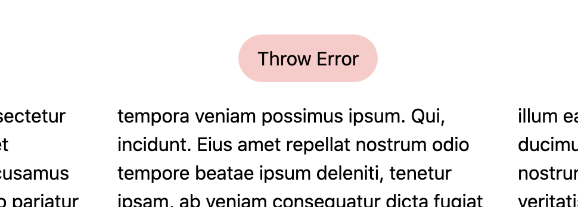
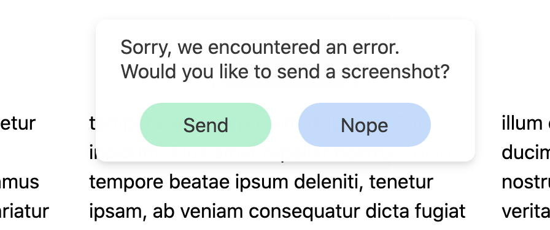
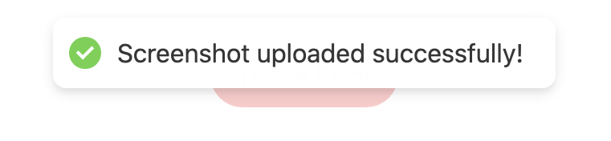

# Screenshot Uploader

- **Use case**: For unexpected errors, allows users to send what they see to the developers as part of a logging strategy.

- **Note**: Updating the DOM with the screenshot is just for demonstration purposes.

## Simulate an unexpected error

## Send screenshot

## Great success!

## All together now

# How to run locally

- After cloning, install npm packages

  - `npm install`

- Use parcel-bundler to watch for frontend changes

  - `npm run watch`

- Use nodemon to watch for backend changes

  - `npm run startDev`

- Navigate to `http://localhost:5500`
